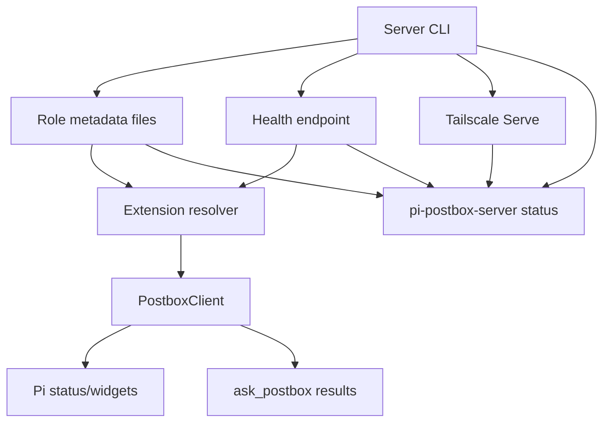

# feat: Add active local Postbox target routing

## Overview

Pi Postbox will stop treating a static localhost URL as the only source of truth. Local server processes will publish fresh role-scoped metadata for the backend URL they actually listen on, and the Pi extension will resolve local targets through that metadata while preserving explicit remote/Tailscale configuration.

The behavior has three local modes:

| Mode | Selection behavior | Override rules |
| --- | --- | --- |
| Explicit non-loopback target | Use the configured `PI_POSTBOX_URL` or config `serverUrl` as-is | Never silently replace with local metadata, including during live polling/reconnect |
| Local dev target present | Use fresh, health-verified dev metadata | Dev outranks production while healthy |
| No dev target present | Use fresh, health-verified production metadata, or a health-verified configured loopback URL as fallback | Stale or unsafe metadata is ignored and diagnosed |

Running Pi sessions will watch the selected active local target. If the target changes while no sent ask or local fallback resolution is pinned to the current target, the client reconnects and re-registers against the new target. If work is pinned to the old target, switching is deferred until that work resolves, flushes, expires, or reaches a client-owned pin deadline so v1 does not strand or duplicate decision cards across independent server runtimes.

---

## Problem Frame

The current extension reads `PI_POSTBOX_URL` or `~/.pi-postbox/config.json` once, then `PostboxClient` reconnects only to that fixed URL. The server CLI already falls back to a free port and prints the actual URL, and `scripts/dev.mjs` already chooses a backend dev port at or after `3500`, but neither path publishes a durable machine-readable target for existing Pi sessions. This leaves local Pi sessions stuck on stale ports and causes split-brain when production and development servers both exist (see origin: `docs/brainstorms/2026-06-15-postbox-self-healing-local-port-requirements.md`).

The plan treats this as an active local target routing problem, not process supervision. Production can remain running while dev is active; Pi routing follows the active local target. This routing is a local convenience boundary, not authentication. It trusts same-user local filesystem state plus loopback services and does not protect against a malicious same-user process that can write valid metadata and serve a matching Postbox-compatible loopback endpoint. V1 should avoid turning that accepted trust boundary into a cross-platform filesystem-security subproject; hardening should focus on fixed filenames, atomic writes, bounded parsing, no symlink following, and clear diagnostics.

---

## Requirements Trace

- R1. Local Pi sessions converge on one active local Postbox server instead of stale ports.
- R2. A healthy local dev server is preferred while running.
- R3. A healthy local production server is the fallback when no dev server is active.
- R4. Dev activation makes production inactive for Pi routing without killing production.
- R5. Already-running Pi sessions reconnect to the selected active local target without manual config edits or Pi restarts, except that sent in-flight asks and local fallback resolutions pin their origin target until resolved, flushed, expired, or released by a bounded client-owned pin deadline.
- R6. Explicit non-loopback URLs remain authoritative.
- R7. Local recovery only accepts loopback candidates, not Tailscale, LAN, `.local`, machine hostnames, or arbitrary private DNS.
- R8. Recovery must end in normal session registration and `ask_postbox` delivery.
- R9. Status should show which active local target was selected.
- R10. Failed recovery should distinguish stale config, no active local server, unsafe metadata, health mismatch, and deferred switching.
- R11. Local server/launcher publishes enough metadata to distinguish dev and production.
- R12. Metadata freshness prevents dead servers from remaining selected.
- R13. The server CLI preferred default port should be `32187` instead of common web-dev ports like `3000`, while still falling back to a free port if that preferred port is occupied.
- R14. When Tailscale is installed and usable, Postbox startup should automatically expose the dashboard over Tailnet-private Tailscale Serve and print the resulting Tailnet URL.
- R15. Tailscale exposure is best-effort: failure to expose must not prevent local Postbox startup, and diagnostics must explain unavailable, unauthenticated, disabled, or conflicting Serve state.
- R16. Automatic Tailscale exposure must not clobber an existing non-Postbox Tailscale Serve mapping. Conflicts should be reported with a safe remediation command or status hint.
- R17. Automatic Tailscale exposure must use Tailnet-private Serve only, never Tailscale Funnel/public internet exposure.
- R18. Production should expose the final bound server port; development should expose the actual Vite UI port because Vite proxies `/api` and `/healthz` to the backend.
- R19. `pi-postbox-server status` should work even when no server is running by inspecting active-local metadata, health, and Tailscale Serve status, and should print local URL, Tailnet URL when available, and copy-paste `PI_POSTBOX_URL` guidance plus JSON output for tooling.
- R20. Automatic Tailscale exposure should be enabled by default when possible but explicitly disableable via `--no-tailscale` and `PI_POSTBOX_TAILSCALE=off`, especially for CI and operators who do not want CLI-managed Serve state.

**Origin actors:** A1 (Pi operator), A2 (Pi extension), A3 (Local Postbox server/launcher)
**Origin flows:** F1 (production starts with no dev), F2 (dev starts while production is running), F3 (dev stops/expires), F4 (intentional remote URL)
**Origin acceptance examples:** AE1 (stale config recovers to production), AE2 (running sessions move prod→dev), AE3 (running sessions recover to restarted production), AE4 (Tailscale URL is not hijacked), AE5 (stale/no metadata diagnostics)

---

## Scope Boundaries

- In scope: localhost/loopback target metadata for local recovery.
- In scope: deterministic dev-over-production selection with production fallback.
- In scope: live retargeting for running sessions when no sent ask or local fallback resolution is pinned to the current target.
- In scope: target affinity for sent asks and local fallback resolutions to avoid cross-server duplication in v1.
- In scope: loopback-only safety checks, fixed role-file metadata, atomic writes, bounded parsing, no symlink following where straightforward, and health identity verification before switching.
- In scope: status and `ask_postbox` diagnostics for recovery decisions.
- In scope: best-effort automatic Tailnet-private Tailscale Serve exposure when Tailscale is installed, logged in, and non-conflicting.
- In scope: `pi-postbox-server status` reporting local and Tailnet access URLs, including JSON output for scripts.
- Out of scope: Tailscale/LAN/remote discovery by Pi extensions beyond explicit `PI_POSTBOX_URL` configuration.
- Out of scope: broad port scanning.
- Out of scope: killing or supervising competing server processes.
- Out of scope: changing dev/production database paths. Current server runtimes may share the default SQLite path, but their WebSocket broadcasters and in-memory connections remain independent.
- Out of scope: silently replacing explicit non-loopback remote URLs.
- Out of scope: Tailscale Funnel/public internet exposure.
- Out of scope: pushing Postbox configuration to other machines automatically; remote machines still use explicit `PI_POSTBOX_URL` copied from status/startup output.

---

## Context & Research

### Relevant Code and Patterns

- `packages/server/src/cli.ts` owns CLI option parsing, `listenWithPortFallback`, shutdown hooks, and printing the actual listening URL.
- `scripts/dev.mjs` starts the backend server on `127.0.0.1` and should pass a dev role marker to the server process.
- `packages/extension/src/config.ts` currently reads file config, then lets `PI_POSTBOX_URL` override `serverUrl`.
- `packages/extension/src/index.ts` calls `readExtensionConfig` during `session_start`, constructs unavailable results when no client exists, and constructs `PostboxClient` with a fixed `serverUrl`.
- `packages/extension/src/client/PostboxClient.ts` owns WebSocket lifecycle, reconnect backoff, pending ask replay, local fallback status, local resolutions, and unavailable results.
- `packages/protocol/src/health.ts` defines `/healthz`; adding optional local target identity keeps generic health consumers backward compatible while letting active-local selection require an identity match.
- `packages/server/test/cli.test.ts`, `packages/extension/test/extension.test.ts`, and `packages/extension/test/resilience.test.ts` already cover integration seams. New focused tests should cover new helper modules directly.
- `docs/adr/0001-pi-session-replacement-lifecycle.md` establishes that transport reconnect/re-registration is not a semantic session replacement.

### Institutional Learnings

- No `docs/solutions/` directory exists in this repository, so there are no prior local learnings to carry forward.

### External References

- External research was skipped for the original active-local routing scope. Tailscale auto-exposure planning later reviewed the local reference implementation in `/home/dev/Development/lizardtail`.

### Lizardtail Reference Findings

`lizardtail` is a Node CLI wrapper that already solves much of the Tailscale Serve mechanics Postbox needs to embed more narrowly:

- It runs `tailscale serve --bg --https <tailscale-port> http://<host>:<local-port>` for Tailnet-private exposure, and only uses `tailscale funnel` when explicitly passed `--public` / `--funnel`.
- It reads `tailscale status --json`, trims `Self.DNSName`, and falls back to a Tailscale IPv4 address if DNS is unavailable, then prints `https://<dns-or-ip>:<tailscale-port>`.
- It inspects `tailscale serve status --json` and `tailscale funnel status --json` to collect already-used Tailnet HTTPS ports from `Web` keys such as `<dns>:8443`.
- Its reusable default is high explicit Tailscale HTTPS ports from `8443` upward, avoiding root `443`; ports `80` and `443` are blocked by default to avoid replacing ingress routes.
- It supports explicit Tailnet HTTPS ports via `--tailscale-port` / `--https-port` and separate Vite exposure ports for multi-service dev flows.
- It checks that the local port accepts connections before exposing, unless disabled.
- If `tailscale serve` fails for a loopback URL target, it retries the older Tailscale-compatible form with just the port number.
- It detects Serve permission errors and gives the operator fix: `sudo tailscale set --operator=$USER` plus the manual serve command.
- It uses fake `tailscale` executables in tests, capturing command logs and stubbing `status --json` / `serve status --json`.

For Postbox, copy the command/status/DNS/permission/testing patterns, but do not copy lizardtail's wrapper lifecycle wholesale: Postbox is the long-lived server, so mappings should be idempotent and persistent until changed by a later Postbox start/status/remediation command, not automatically removed when a child command exits.

---

## Key Technical Decisions

| Decision | Rationale |
| --- | --- |
| Store one fixed metadata file per role under the existing Postbox config base | Avoids racy read/modify/write merges between dev and production writers. Fixed filenames also avoid unsafe role-derived paths and avoid adding a new public metadata-directory override in v1. |
| Default server role is `production`; dev is opt-in via CLI/env | Preserves current CLI behavior and lets `scripts/dev.mjs` mark only source-checkout dev servers as preferred. |
| Preferred default local port is `32187`, not `3000` | `3000` is heavily used by web development servers. A high uncommon default reduces conflicts, while `--port` / `PI_POSTBOX_PORT` and fallback-to-free-port behavior still preserve operator control and resilience. |
| Tailscale Serve is automatic but best-effort | Startup should try to expose when Tailscale is installed and usable because Postbox is meant to be opened from other devices. Local startup must still succeed if Tailscale is missing, logged out, disabled, or conflicting. |
| Automatic exposure uses a dedicated matching HTTPS port | Prefer `https://<machine>.<tailnet>:<actual-port>` rather than taking over root `https://<machine>.<tailnet>/`. This minimizes conflicts and makes the URL match the port Postbox actually selected. |
| Never clobber non-Postbox Tailscale Serve mappings | Convenience must not destroy another local service's Tailnet exposure. If the target Tailnet port/path is occupied by something else, report a conflict and keep local Postbox running. |
| Development exposes Vite, production exposes the server | Production's server port serves the app. In development the browser should hit Vite's actual port because it proxies `/api` and `/healthz` to the backend and serves live UI/HMR. |
| `pi-postbox-server status` is offline-capable | Status should inspect metadata, health, and Tailscale Serve state without requiring the server to already be running, then print local URL, Tailnet URL, conflict/error state, and `PI_POSTBOX_URL` guidance. |
| Tailscale auto-exposure can be disabled | Auto-expose is the default for convenience, but `--no-tailscale` / `PI_POSTBOX_TAILSCALE=off` lets CI and operators avoid any Tailscale Serve mutation. |
| Non-loopback server launches do not publish active-local metadata | Servers bound to `0.0.0.0`, LAN, hostname, or remote interfaces may still run, but they must not overwrite local routing records. |
| Health local target identity is optional in the schema but required for metadata-based selection | Existing health consumers remain compatible; active-local routing still requires exact role, instance id, and normalized backend URL match. |
| Non-loopback config is strict; loopback config is recoverable after effective env-over-config precedence | This preserves Tailscale/hosted intent while fixing the stale-local-port failure that motivated the feature. If an operator intentionally pins a local fixture through loopback config, active-local metadata can still override it by design; use non-loopback remote config for strict no-local-recovery behavior. |
| Running clients poll/watch local metadata and retarget when the selected instance changes | Reconnect-only behavior cannot satisfy prod→dev while the production socket remains healthy. |
| Sent asks and local fallback resolutions carry origin-target affinity with a bounded pin deadline | V1 avoids duplicating or stranding decision cards across independent server runtimes, but a permanently dead origin must not block convergence forever. Unsent asks can safely follow the selected target. |
| Active-local metadata uses numeric loopback HTTP(S) URLs with no credentials, query, fragment, or unexpected path | Servers should publish `127.x.x.x` or `[::1]`, not `localhost`. Configured `localhost` can remain a loopback input only if resolution/probing proves it stays on loopback. Private LAN, Tailscale DNS, `.local`, machine hostnames, `0.0.0.0`, ambiguous numeric IP forms, and URL smuggling tricks are not local recovery candidates. |
| Active-local diagnostics are sanitized | Status/tool output may enter model transcripts, so diagnostics should expose category, role, host/port, age, and reason — not absolute paths, command lines, env values, credentials, queries, or raw metadata. |
| Explicit remote URLs keep user intent but still need safe handling | Non-loopback targets are not local recovery candidates. The resolver should reject credentials in configured URLs, preserve HTTPS/Tailscale usage, and surface a warning/diagnostic for cleartext non-loopback HTTP rather than silently rewriting it. |

---

## Open Questions

### Resolved During Planning

- Should loopback `PI_POSTBOX_URL` be recoverable? Yes. Non-loopback env/config remains authoritative; loopback env/config participates in active-local resolution so stale local ports can recover.
- How should pending asks behave during a target change? Sent asks pin their origin target until resolved, expired, or released by a bounded client-owned pin deadline. Unsent asks may follow a newly selected target because no remote card exists yet.
- Should Pi auto-connect when config is absent but fresh active-local metadata exists? Yes. Absence of explicit remote intent should not block local recovery.
- Should the dev UI port be advertised? No. Metadata should advertise the backend API/WebSocket URL, not Vite `5173`, unless a future version intentionally supports that proxy path.
- Should this plan change dev database paths? No. Target-affinity is still required because server runtimes have independent WebSocket connections/broadcasters even when the SQLite database path is shared.

### Deferred to Implementation

- Exact heartbeat/poll/TTL constants: choose values in code and tune through tests; they should be short enough for local recovery without busy polling.
- Exact status strings: keep concise and test the important substrings/diagnostic categories rather than freezing every character.
- Platform-specific filesystem safety behavior: v1 should strictly avoid symlink-following and unsafe derived filenames, create files/directories restrictively when it owns them, and treat deeper owner/mode/hardlink checks as best-effort diagnostics unless the platform exposes a clear unsafe condition. Tests may need platform guards for OS-specific ownership semantics.
- Exact Tailscale command strategy: lizardtail confirms `tailscale serve --bg --https <tailnet-port> http://127.0.0.1:<local-port>` is the working primary form, with a fallback to target `<local-port>` for older Tailscale behavior. Postbox should adapt this pattern after inspecting `tailscale serve status --json`.

---

## High-Level Technical Design

> *This illustrates the intended approach and is directional guidance for review, not implementation specification. The implementing agent should treat it as context, not code to reproduce.*

```mermaid
flowchart TB
  Server[pi-postbox-server binds actual URL]
  Identity[Mutable health identity set after bind]
  Publish[Publish role file if URL is loopback-safe]
  Health[/healthz returns local target identity]
  Resolver[Extension target resolver]
  Client[PostboxClient]
  Remote[Explicit non-loopback URL]

  Server --> Identity
  Identity --> Health
  Server --> Publish
  Publish --> Resolver
  Health --> Resolver
  Remote --> Resolver
  Resolver -->|strict remote| Client
  Resolver -->|fresh dev/prod local target| Client
  Client -->|no sent asks/resolutions pinned| Reconnect[Close socket and re-register]
  Client -->|sent ask or local resolution pinned| Defer[Defer switch and keep origin target]
  Defer --> Resolver
```

Selection logic, expressed as behavior rather than code:

1. If config/env points to a non-loopback URL, return that target and disable active-local polling for the client.
2. Otherwise read only the fixed `dev.json` and `production.json` role metadata files from the active-local directory derived from the existing config base.
3. Reject symlinked metadata and bounded-parse failures before trusting file contents; apply deeper owner/mode/hardlink checks as best-effort diagnostics unless clearly unsafe on the current platform.
4. Reject records that are malformed, stale, non-loopback, use an unsafe URL shape, or fail bounded no-redirect health verification.
5. Require `/healthz` to return expected service/protocol plus local target identity exactly matching metadata role, instance id, and normalized backend URL.
6. Select fresh dev if available; else fresh production; else try a health-verified configured loopback URL when present.
7. Surface sanitized rejected-record categories in diagnostics when no healthy active local target exists.

---

## Implementation Units

- [ ] U1. **Define active-local metadata contract and safety helpers**

**Goal:** Create the shared schema, path convention, URL validation, and deterministic selection rules used by both server publishing and extension resolution.

**Requirements:** R1, R2, R3, R6, R7, R10, R11, R12; supports AE1, AE2, AE4, AE5

**Dependencies:** None

**Files:**
- Create: `packages/protocol/src/activeLocal.ts`
- Modify: `packages/protocol/src/index.ts`
- Modify: `packages/protocol/src/health.ts`
- Test: `packages/protocol/src/activeLocal.test.ts`
- Test: `packages/protocol/src/health.test.ts`

**Approach:**
- Define role values (`dev`, `production`), candidate metadata fields, health identity fields, and a versioned metadata record.
- Require each server process to use a cryptographically random per-process instance id generated at startup. Treat it as an accidental-port-reuse guard, not an authentication secret.
- Document the shared path contract in code comments/types: base config directory is `PI_POSTBOX_CONFIG_DIR`, else the directory containing `PI_POSTBOX_CONFIG_PATH`, else `~/.pi-postbox`; active-local directory is `<base>/active-local`; role files use fixed names `dev.json` and `production.json`. Do not add a separate v1 active-local directory override.
- Keep Node filesystem access out of protocol helpers. Protocol should own pure schemas, URL safety, diagnostic categories, and selection over already-loaded records.
- Add optional local target identity to the health response schema and health response factory options. Optionality is only for backward-compatible general `/healthz` consumers; U4 must require identity for metadata-based selection.
- Implement pure helpers for loopback URL classification, URL normalization, staleness checks, role precedence, and sanitized diagnostics.
- Define exact accepted metadata URL shape: HTTP(S), no username/password, no query, no fragment, root or empty path only, numeric loopback host for metadata (`127.x.x.x` or `[::1]`), and a valid port when required by the URL. Configured `localhost` loopback fallbacks may be supported separately only with loopback-only resolution/probing.
- Reject ambiguous or unsafe forms including `0.0.0.0`, private/LAN IPs, link-local/private IPv6, IPv4 integer/octal/hex forms, IPv4-mapped IPv6 unless normalized to an allowed loopback form, IPv6 zone IDs, localhost subdomains/trailing-dot tricks, `.local`, Tailscale-like names, and arbitrary hostnames.

**Patterns to follow:**
- Zod schema/export style in `packages/protocol/src/ask.ts`, `packages/protocol/src/session.ts`, and `packages/protocol/src/index.ts`.
- Health response parsing style in `packages/protocol/src/health.ts` and `packages/protocol/src/health.test.ts`.

**Test scenarios:**
- Happy path: fresh dev and fresh production records are both present -> dev is selected.
- Happy path: only fresh production is present -> production is selected.
- Edge case: dev record is stale and production is fresh -> production is selected.
- Edge case: no records are fresh -> no active local target is selected and diagnostics include stale metadata.
- Edge case: metadata instance id is missing or not a valid generated id shape -> metadata candidate is rejected.
- Error path: malformed role, invalid timestamp, invalid URL, or non-loopback URL -> record is rejected with a diagnostic category.
- Error path: ambiguous URL forms and non-loopback/private/local-network hosts are rejected.
- Compatibility: `HealthResponseSchema` accepts existing health responses without local target identity and accepts new responses with local target identity.

**Verification:**
- Shared helpers can select dev/prod candidates deterministically without reading or writing files.
- Health schema changes are backward compatible for existing `/healthz` tests.

---

- [ ] U2. **Publish fresh role-scoped metadata from the server CLI**

**Goal:** Make each local Postbox server publish its actual backend URL, role, and instance identity after binding to the final port.

**Requirements:** R1, R2, R3, R4, R11, R12, R13; supports AE1, AE2, AE3

**Dependencies:** U1

**Files:**
- Create: `packages/server/src/activeLocalTarget.ts`
- Modify: `packages/server/src/cli.ts`
- Modify: `packages/server/src/app.ts`
- Test: `packages/server/test/activeLocalTarget.test.ts`
- Test: `packages/server/test/cli.test.ts`
- Test: `packages/server/test/app.test.ts`

**Approach:**
- Change the CLI preferred default port from `3000` to `32187`, while preserving `--port` / `PI_POSTBOX_PORT` overrides and fallback-to-free-port behavior when the preferred port is busy.
- Extend CLI parsing with a role option/env, defaulting to production. `scripts/dev.mjs` will supply dev in U3.
- Implement the shared active-local directory convention from U1. Tests should isolate state by setting `PI_POSTBOX_CONFIG_DIR` or `PI_POSTBOX_CONFIG_PATH`; do not add a separate active-local directory override in v1. Constrain writes to fixed role filenames under the derived directory; do not derive file paths from untrusted role strings beyond the validated role enum.
- Create the active-local directory with restrictive permissions when the server owns it and write files atomically with restrictive file permissions. Do not follow symlinks. Strictly skip symlinked metadata paths; treat hardlink/owner/mode checks as best-effort diagnostics unless the platform exposes a clear unsafe condition.
- After `listenWithPortFallback` returns, derive the advertised backend URL from Fastify's actual address and normalize metadata publication to numeric loopback where possible. Skip metadata publication and omit health local-target identity if that URL is not loopback-safe.
- Use a mutable/provider-based local target identity in `createPostboxApp` because the app is created before the final listen URL is known. Set the identity only after binding succeeds so `/healthz` never reports the requested port when fallback occurred.
- Write metadata periodically while the process is alive, but refresh only while this process still owns the same-role record. If another same-role instance takes ownership, the older writer must stop refreshing or avoid reclaiming the file. On shutdown, remove or mark only this instance's same-role record stale if it still owns that record; an older process must not delete a newer same-role instance.
- Ensure metadata publication is best-effort: failures should warn and be diagnosable but should not prevent the server from starting.
- Do not kill or stop production when dev starts; selection is handled by metadata freshness and client-side precedence.

**Patterns to follow:**
- CLI option parsing and validation style in `packages/server/src/cli.ts`.
- Existing shutdown hook shape in `packages/server/src/cli.ts`.
- Health route construction in `packages/server/src/app.ts`.
- Temporary directory and port reservation patterns in `packages/server/test/cli.test.ts`.

**Test scenarios:**
- Happy path: server starts on requested local port -> role metadata contains production role, actual URL, fresh timestamp, and instance id.
- Happy path: requested port is busy and server falls back -> metadata and `/healthz` advertise the fallback URL, not the requested port.
- Happy path: dev role option/env -> metadata records role `dev` and `/healthz` reports matching local target identity.
- Edge case: dev and production records coexist -> publishing one role does not erase the other role.
- Edge case: two same-role instances race -> the older instance does not reclaim the role file on heartbeat after a newer instance owns it, and shutdown/cleanup from the older instance does not remove the newer instance's record.
- Error path: invalid role option/env -> CLI parsing fails with a clear error.
- Error path: final advertised URL is non-loopback -> server listens but does not publish active-local metadata.
- Error path: metadata path is symlinked or otherwise clearly unsafe -> server skips publication without crashing; owner/mode/hardlink diagnostics are best-effort and platform-aware.
- Integration: `/healthz` returns local target identity that exactly matches the published metadata for the running instance.

**Verification:**
- A running loopback server publishes a fresh, health-verifiable metadata record for the URL it actually listens on.
- Shutting down or replacing a server cannot indefinitely select a dead or older same-role instance.

---

- [ ] U3. **Mark development launches as the preferred local role**

**Goal:** Ensure source-checkout development servers publish themselves as `dev` while ordinary `pi-postbox-server` launches remain production.

**Requirements:** R2, R3, R4, R11; supports AE2, AE3

**Dependencies:** U2

**Files:**
- Modify: `scripts/dev.mjs`
- Test: `packages/server/test/cli.test.ts`

**Approach:**
- Pass the dev role marker from `scripts/dev.mjs` to the backend server process.
- Preserve the current dev launcher behavior of choosing the backend API port at/after `3500`; if the server falls back again after a race, metadata still comes from the actual bound address.
- Keep CLI role default tests in `packages/server/test/cli.test.ts`. Only add launcher-specific test coverage if `scripts/dev.mjs` is refactored into testable units; otherwise validate the behavior through a smoke/manual path in U6.
- Do not change the dev database path in this unit.

**Patterns to follow:**
- Existing `scripts/dev.mjs` child process environment passing for `POSTBOX_DEV_API_PORT`.
- CLI default/override tests in `packages/server/test/cli.test.ts`.

**Test scenarios:**
- Happy path: CLI role parsing accepts the dev marker used by the launcher.
- Edge case: production CLI without role marker remains production.
- Integration/manual expectation: `npm run dev` starts a backend that publishes a dev metadata candidate.

**Verification:**
- Starting the dev script results in a dev metadata candidate, while starting the server CLI directly results in production metadata.

---

- [ ] U4. **Resolve extension configuration through active-local metadata**

**Goal:** Replace static URL selection with a resolver that honors explicit remote intent while recovering stale or missing loopback configuration.

**Requirements:** R1, R2, R3, R6, R7, R8, R9, R10, R12; supports AE1, AE3, AE4, AE5

**Dependencies:** U1

**Files:**
- Create: `packages/extension/src/activeLocalTargetResolver.ts`
- Modify: `packages/extension/src/config.ts`
- Modify: `packages/extension/src/index.ts`
- Modify: `packages/extension/src/tools/askPostbox.ts`
- Test: `packages/extension/test/activeLocalTargetResolver.test.ts`
- Test: `packages/extension/test/extension.test.ts`
- Test: `packages/extension/test/askPostbox.test.ts`

**Approach:**
- Introduce a target resolution object rather than returning only `serverUrl`. It should include selected URL, source (`explicit-remote`, `active-local`, `configured-loopback`, or unavailable), role when known, active-local polling/supervisor eligibility, and sanitized diagnostics.
- First compute the effective configured URL using existing env-over-config precedence. If that effective URL is non-loopback, return it directly and disable active-local polling/supervision for the session. If the effective URL is loopback, it is recoverable through active-local metadata.
- Treat loopback env/config URLs as recoverable: prefer a fresh health-verified active-local candidate over stale or secondary loopback config.
- If no URL is configured, still use fresh active-local metadata when available.
- Read only the fixed `dev.json` and `production.json` files; do not scan the active-local directory. Implement v1 filesystem safety checks before reading metadata: derived directory, fixed role filenames, no symlink following where straightforward, and bounded file size/schema parsing. Treat deeper hardlink/owner/mode checks as best-effort diagnostics unless clearly unsafe on the current platform.
- Verify selected metadata with bounded no-redirect `/healthz` probes that ignore proxy settings, use tight timeouts, and never probe records already rejected by URL/path validation. Because v1 has exactly two role files, do not implement directory scanning or generic candidate-count machinery.
- For metadata candidates, require `/healthz` to return expected service/protocol plus exact matching local target identity. Configured loopback fallback should be health-verified before being reported as selected; otherwise report it as attempted/unavailable rather than recovered.
- Store latest resolver diagnostics where the `ask_postbox` tool handler in `packages/extension/src/index.ts` can use them when `!client || !currentRegistration`. Add an extension-level active-local supervisor in `index.ts` so sessions that start before any local target exists keep resolving eligible local metadata and create a client when a target appears.
- Thread resolver diagnostics into UI status and unavailable `ask_postbox` results so users can distinguish stale config, no active metadata, unsafe record rejection, health mismatch, and unsafe path.
- Redact diagnostics: no full absolute metadata paths, command lines, env values, query strings, credentials, database paths, or raw metadata in model-visible tool output.

**Patterns to follow:**
- Config path override handling in `packages/extension/src/config.ts`.
- Session startup/status handling and no-client unavailable result construction in `packages/extension/src/index.ts`.
- Ask result formatting in `packages/extension/src/tools/askPostbox.ts`.

**Test scenarios:**
- Covers AE1. Given config points to dead `http://127.0.0.1:33375` and fresh production metadata points to `http://127.0.0.1:3500`, registration uses `3500`.
- Covers AE4. Given `PI_POSTBOX_URL` is a Tailscale/HTTPS URL and fresh local metadata exists, registration uses the Tailscale URL and does not read/probe/switch to local metadata.
- Happy path: no configured URL at session start and no active metadata exists; later fresh dev metadata appears -> the extension-level supervisor creates a client and registers without requiring a Pi restart.
- Happy path: configured loopback is unhealthy at session start; later active-local metadata appears -> the supervisor creates or retargets the client to the active local target.
- Happy path: no configured URL but fresh dev metadata exists -> registration uses dev.
- Edge case: loopback config is healthy but fresh dev metadata appears -> resolver selects dev because dev is the active local target.
- Edge case: configured loopback fallback is available but no metadata exists -> resolver may use it only after health verification and reports it as configured-loopback, not active-local recovery.
- Error path: metadata file is symlinked, too large, malformed, stale, or clearly unsafe -> resolver rejects it with a sanitized diagnostic; owner/mode/hardlink diagnostics are platform-aware and best-effort.
- Error path: metadata URL is private LAN, hostname, `0.0.0.0`, malformed, or health-mismatched -> resolver rejects it and reports why.
- Error path: no active metadata and configured loopback is unavailable -> no-client and `ask_postbox` unavailable rationale includes no active local target/stale config detail.
- Integration: status text includes selected role and sanitized host/port when active-local recovery succeeds.

**Verification:**
- Extension startup no longer reports “Postbox not configured” when fresh active-local metadata exists.
- Explicit non-loopback URLs are never replaced by local recovery at startup.

---

- [ ] U5. **Retarget running clients with target affinity**

**Goal:** Make already-running Pi sessions follow active local target changes while preserving pending ask and local-resolution correctness.

**Requirements:** R1, R4, R5, R8, R9, R10; supports AE2, AE3

**Dependencies:** U4

**Files:**
- Modify: `packages/extension/src/client/PostboxClient.ts`
- Modify: `packages/extension/src/index.ts`
- Test: `packages/extension/test/resilience.test.ts`
- Test: `packages/extension/test/localFallback.test.ts`

**Approach:**
- Change `PostboxClient` from an immutable `serverUrl` to a current target plus optional async resolver/poll hook supplied by the extension.
- Do not install the active-local poll hook or no-client supervisor for explicit non-loopback targets. Remote/Tailscale targets must not switch to local metadata during reconnect, polling, or remote outages.
- Before reconnect attempts and on a periodic active-target check while connected, resolve the current target.
- Track target affinity for asks and local resolutions:
  - unsent asks may move to the newly selected target;
  - sent asks remain pinned to the target where `ask.create` was sent until resolved/expired or until a client-owned pin deadline releases the session with an unavailable/undeliverable diagnostic;
  - local fallback resolutions flush only to their origin target, or switching waits until those resolutions are flushed/cleared/released by the pin deadline.
- If the selected URL/instance differs and no sent asks or local resolutions are pinned to the current target, close the old socket, connect to the new target, re-register the same session, replay safe pending work, and reset reconnect backoff.
- If a sent ask or local resolution is pinned, keep reconnecting to the origin target and publish a status such as “active target changed to dev; switch deferred until pending ask resolves.” After the pinned work clears, run target resolution again and switch if still needed.
- Ensure local fallback commands remain tied to the pending ask and do not disappear just because a target switch is deferred.
- Reuse existing idempotent `ask.create` replay behavior only within the selected/origin server target; do not intentionally replay an unresolved sent ask to a different server in v1.

**Patterns to follow:**
- Existing reconnect, pending ask replay, unavailable timer, and local resolution flush logic in `packages/extension/src/client/PostboxClient.ts`.
- ADR guidance in `docs/adr/0001-pi-session-replacement-lifecycle.md`: retargeting is a transport reconnect/re-registration, not a semantic session replacement.

**Test scenarios:**
- Covers AE2. Client is connected to production; dev metadata becomes fresh while no ask is pinned -> client closes/reconnects to dev and sends `session.register` to dev.
- Covers AE3. Client is disconnected from stale production; production restarts on a new port and publishes metadata -> reconnect uses the new port and registers.
- Covers AE4 live-session regression. Client uses explicit non-loopback `PI_POSTBOX_URL`; fresh dev metadata appears and/or remote is down -> client never switches to local metadata.
- Edge case: dev becomes active while an ask has already been sent to production -> client stays pinned to production, status says switch deferred, and does not create an `ask.create` on dev before the ask resolves/expires/pin deadline releases.
- Edge case: ask is queued but never sent before target changes -> ask follows the new target without duplicate-card risk.
- Edge case: sent ask has no explicit `expiresAt`, origin target dies permanently, and dev becomes active -> client-owned pin deadline eventually releases the dead origin with an unavailable/undeliverable diagnostic and permits retargeting.
- Edge case: local fallback answer/cancel exists for an origin target -> resolution is flushed to that origin target before switching, or switching remains deferred until the pin deadline releases it with a diagnostic.
- Edge case: deferred switch is still relevant after pinned work clears -> client switches to dev on the next resolution cycle.
- Edge case: deferred switch disappears because dev goes stale before pinned work clears -> client remains or falls back according to fresh selection.
- Error path: resolver reports no active target during reconnect -> unavailable result includes the latest sanitized diagnostic.
- Integration: pending ask local fallback status remains visible while target switching is deferred.

**Verification:**
- Running sessions converge to the active local target when safe to do so.
- No v1 code path duplicates a sent pending ask or local fallback resolution across production and dev server runtimes.

---

- [ ] U6. **Update docs, smoke coverage, and operational diagnostics**

**Goal:** Make the active-local model discoverable and cover the end-to-end behavior that matters to operators.

**Requirements:** R8, R9, R10, R13; supports AE1-AE5

**Dependencies:** U2, U3, U4, U5

**Files:**
- Modify: `docs/configuration.md`
- Modify: `docs/deployment.md`
- Modify: `docs/protocol.md`
- Modify: `README.md`
- Modify: `scripts/smoke-postbox.mjs`
- Test: `packages/server/test/packageDocs.test.ts`

**Approach:**
- Document active-local metadata as a local-only routing contract: role-scoped files, dev wins while fresh, production fallback, no remote/Tailscale discovery.
- Document role option/env, the `32187` preferred default port, the active-local directory convention, path overrides, freshness behavior, loopback definition, and diagnostics categories.
- Document the local trust model clearly: same-user local metadata and loopback services are trusted for routing convenience; this is not app-level authentication and does not defend against malicious same-user local processes.
- Document that non-loopback `PI_POSTBOX_URL` remains authoritative, including for live polling/reconnect.
- Update protocol docs for optional `/healthz` local target identity and note that active-local clients require it for metadata candidates.
- Ensure smoke/tests use temporary config/active-local directories so CLI publication never touches real `~/.pi-postbox` state.
- Extend the smoke script only if it can verify active-local behavior without making the smoke brittle. At minimum, smoke should tolerate and inspect the new health field when present.

**Patterns to follow:**
- Existing concise docs tables in `docs/configuration.md`.
- Tailscale trust-boundary wording in `docs/deployment.md`.
- Existing smoke script’s packaged-path, fake-extension style.
- Documentation assertions in `packages/server/test/packageDocs.test.ts`.

**Test scenarios:**
- Documentation expectation: config docs describe active-local metadata, role precedence, path convention derived from existing config vars, role flag/env, and local target diagnostics.
- Documentation expectation: deployment docs explicitly state Tailscale/hosted URLs are explicit remote targets and not local recovery candidates.
- Documentation expectation: protocol docs describe optional health identity and active-local identity matching.
- Smoke isolation: packaged smoke uses a temp active-local/config directory and does not modify the operator’s real Postbox config.
- Smoke compatibility: existing packaged smoke still verifies registration, ask delivery, answer reconciliation, state, and history with active-local health fields present.

**Verification:**
- A developer/operator can understand why Pi selected dev, production, remote, or no target from docs and status output.
- Existing smoke and package documentation checks continue to pass with the active-local additions.

---

- [ ] U7. **Auto-expose Postbox over Tailnet-private Tailscale Serve**

**Goal:** Make a running Postbox immediately reachable from other Tailnet devices when Tailscale is available, while preserving safe local startup and avoiding destructive Serve changes.

**Requirements:** R14, R15, R16, R17, R18, R19, R20; supports operator workflow of opening the dashboard from phone/laptop and copying the correct `PI_POSTBOX_URL` to other machines.

**Dependencies:** U2, U3, U6

**Files:**
- Create: `packages/server/src/tailscaleServe.ts`
- Modify: `packages/server/src/cli.ts`
- Modify: `scripts/dev.mjs`
- Modify: `docs/configuration.md`
- Modify: `docs/deployment.md`
- Modify: `README.md`
- Test: `packages/server/test/tailscaleServe.test.ts`
- Test: `packages/server/test/cli.test.ts`
- Test: `packages/server/test/packageDocs.test.ts`

**Approach:**
- Add a small Tailscale integration layer that shells out to the installed `tailscale` CLI. Keep it isolated and mockable; do not add a long-running Tailscale SDK dependency in v1. Use lizardtail's command-exec shape and fake-CLI test pattern as reference.
- Add `--no-tailscale` and `PI_POSTBOX_TAILSCALE=off` to disable automatic Tailscale Serve mutation. Status may still report Tailscale availability unless explicitly told not to inspect it.
- On production startup, after the server has bound and the final local URL/port is known, check whether `tailscale` is installed and usable. If yes, inspect `tailscale serve status --json` before changing anything.
- Automatically expose production on a dedicated Tailnet HTTPS port matching the actual bound local port, e.g. `https://<machine>.<tailnet>:32187` for `http://127.0.0.1:32187`. If the local server fell back to a different port, expose that actual port instead. Unlike lizardtail's generic default of first free `8443+`, Postbox should prefer the actual local Postbox port because the port is already high/uncommon and makes the URL/config obvious.
- Never overwrite a non-Postbox Serve mapping. Inspect `tailscale serve status --json` `Web` entries before mutating. If the target Tailnet HTTPS port already proxies to this Postbox instance, treat it as healthy/idempotent. If it proxies elsewhere, report `tailscale-conflict` and leave the mapping untouched.
- Keep exposure best-effort. Missing CLI, unauthenticated Tailscale, Serve disabled, command failure, or conflict must not fail Postbox startup; startup prints the local URL plus a concise Tailscale diagnostic. Permission-denied diagnostics should mirror lizardtail's actionable hint: run `sudo tailscale set --operator=$USER` once, or run the printed manual `tailscale serve --bg --https ...` command with appropriate privileges.
- Never enable Tailscale Funnel or public internet exposure automatically. Do not add Funnel support in this plan.
- Add `pi-postbox-server status` and `pi-postbox-server status --json`. It should work without a running server by inspecting active-local metadata, probing `/healthz` when a candidate exists, and reading Tailscale Serve status. Human output should include local URL, Tailnet URL when available, conflict/error status, and a copy-paste `export PI_POSTBOX_URL=...` line for remote Pi machines. Tailnet URL construction should follow lizardtail: read `tailscale status --json`, prefer `Self.DNSName` with trailing dot removed, and fall back to a Tailscale IPv4 address if needed.
- Update `scripts/dev.mjs` so development exposure targets the actual Vite UI port, not the backend API port. The dev script should detect or allocate a free UI port if `5173` is busy, pass that to Vite, and expose that actual UI port over Tailscale when non-conflicting. Backend active-local metadata still advertises the backend API URL for Pi extension traffic.
- Keep remote Pi extension behavior explicit: other machines do not discover this server automatically; users/scripts configure `PI_POSTBOX_URL` from startup/status output.

**Patterns to follow:**
- Existing CLI parsing and output style in `packages/server/src/cli.ts`.
- Existing dev orchestrator process management in `scripts/dev.mjs`.
- Existing docs' Tailscale trust-boundary language in `docs/deployment.md`.
- Lizardtail implementation in `/home/dev/Development/lizardtail/src/index.ts`, especially `exposeWithTailscaleDetailed`, `getTailscaleDnsName`, `getTailscaleExposureStatus`, port collection from status `Web` keys, permission-error help, and fake-CLI tests.
- Mock external commands in focused unit tests rather than requiring Tailscale in CI.

**Test scenarios:**
- Happy path: Tailscale installed/logged in and no Serve conflict -> startup runs `tailscale serve --bg --https <actual-port> http://127.0.0.1:<actual-port>` and prints local + Tailnet URLs.
- Happy path: existing Serve mapping already points at the same Postbox local URL -> startup is idempotent and prints the Tailnet URL.
- Happy path: `pi-postbox-server status --json` reports running local URL, Tailnet URL, selected role, and copy-paste remote config when available.
- Happy path: dev UI port `5173` is busy -> dev picks a free UI port, Vite uses it, and Tailscale exposure targets that actual UI port.
- Edge case: server falls back from preferred `32187` to another port -> Tailscale exposure uses the fallback port and status prints the fallback Tailnet URL.
- Edge case: Tailscale CLI missing, logged out, or Serve unavailable -> startup still succeeds locally and status reports a sanitized unavailable reason.
- Edge case: `tailscale serve` rejects loopback URL target but accepts bare port target -> retry with the bare port form and report success.
- Edge case: Serve permission denied -> startup still succeeds locally and prints `sudo tailscale set --operator=$USER` guidance plus the manual serve command.
- Edge case: target Tailnet port already serves a non-Postbox proxy -> startup does not overwrite it; status reports a conflict and a remediation hint.
- Safety: no command path enables Funnel/public exposure.
- Opt-out: `--no-tailscale` / `PI_POSTBOX_TAILSCALE=off` skips Serve mutation while local startup and status still work.
- Regression: explicit remote `PI_POSTBOX_URL` behavior in the extension remains strict and is not replaced by locally detected Tailnet URLs.

**Verification:**
- Starting Postbox on a Tailscale-enabled machine gives the operator a usable Tailnet URL without running lizardtail manually.
- Other machines can be configured by copying the printed `PI_POSTBOX_URL` value.
- Local startup remains reliable when Tailscale is absent or broken.

---

## System-Wide Impact



- **Interaction graph:** Server CLI publishes role metadata and health identity; extension resolver validates metadata path/file safety and probes `/healthz`; `PostboxClient` consumes resolver output for connect/reconnect; Pi status and `ask_postbox` expose selected target or failure diagnostics.
- **Error propagation:** Metadata parse/validation/safety errors should not crash Pi startup or server startup. They become sanitized resolver diagnostics and, when no usable target exists, unavailable rationales. If no client exists yet and local supervision is eligible, the extension keeps trying until a target appears or the session shuts down.
- **State lifecycle risks:** Server runtimes have independent WebSocket connections and broadcasters even if they share a SQLite path. Sent asks and local resolutions must keep target affinity until resolved/flushed/expired, but client-owned pin deadlines prevent permanently dead origins from blocking convergence forever.
- **API surface parity:** HTTP health schema changes must remain backward compatible. CLI/env additions must not break existing no-arg server launches beyond adding best-effort Tailscale exposure side effects. Explicit remote configuration must be honored equally at startup and during reconnect polling.
- **Integration coverage:** Unit tests alone are insufficient for target switching; extension resilience tests should prove re-registration on a new fake socket/URL, explicit remote no-hijack during live polling, and no duplicate sent ask replay across targets.
- **Unchanged invariants:** Session replacement semantics remain unchanged. `/new`, `/resume`, `/fork`, quit, and reload behavior follow `docs/adr/0001-pi-session-replacement-lifecycle.md`; active-local retargeting is only a transport reconnect. Remote Pi machines still use explicit `PI_POSTBOX_URL`; Tailnet URL printing does not become cross-machine discovery.

---

## Risks & Dependencies

| Risk | Mitigation |
| --- | --- |
| Stale dev metadata blocks production recovery | Use role-scoped freshness, periodic heartbeats, health verification, and TTL expiry; production wins once dev is stale or unhealthy. |
| Metadata points to the wrong local service or a reused port | Require loopback URL validation plus `/healthz` service/protocol/local-target identity match before selecting metadata. |
| Metadata file is malformed or redirected through symlinks | Use fixed filenames, no directory scanning, no symlink following where straightforward, restrictive writes for owned files, bounded file sizes, schema validation, and sanitized rejection diagnostics. Treat deeper owner/mode/hardlink checks as best-effort v1 hardening. |
| Another same-user process spoofs valid metadata and health | Document the trust boundary honestly; v1 trusts same-user local filesystem/loopback and is not an auth boundary. Consider a per-instance local secret only if this threat enters scope later. |
| Running clients stay on production while dev is active | Add active-target polling/watch while connected, not only reconnect-on-close. |
| Pending asks or local resolutions duplicate across dev/prod runtimes or block convergence forever | Track target affinity; sent asks/local resolutions pin their origin target until resolved/flushed/expired, but a client-owned pin deadline releases permanently dead origins with a diagnostic. |
| Explicit Tailscale/remote workflows are hijacked | Treat non-loopback env/config as strict and disable active-local polling for those clients; test startup and live-session cases. |
| Metadata writers race | Use fixed role-scoped files, heartbeat ownership checks, and same-instance cleanup checks instead of one shared JSON map. An older same-role writer must not reclaim a file owned by a newer instance. |
| Diagnostics leak sensitive local details | Redact paths, credentials, env values, queries, command lines, database paths, and raw metadata; expose only category, role, sanitized host/port, and age. |
| Health probes hang or probe unintended targets | Reject unsafe candidates before probing, limit candidate count, use tight timeouts, disable redirects/proxies, and probe only normalized loopback URLs. |
| Tailscale auto-exposure overwrites another service | Inspect `tailscale serve status --json` first, require idempotent same-target matching, and never clobber non-Postbox mappings. |
| Tailscale failure makes local Postbox unreliable | Treat Tailscale as best-effort; missing CLI, logged-out state, Serve errors, or conflicts become diagnostics, not startup failures. |
| Tailnet URL accidentally becomes public | Never enable Funnel in this plan; docs should state automatic exposure is Tailnet-private Serve only. |
| Dev exposes the wrong UI | Make dev expose the actual Vite UI port and keep backend active-local metadata separate for Pi extension traffic. |

---

## Documentation / Operational Notes

- Update local configuration docs to describe the active-local directory derived from existing config vars, role files, role precedence, freshness, loopback definition, effective env-over-config precedence, and recovery behavior.
- Update deployment docs to explain automatic Tailnet-private Tailscale Serve exposure, conflict behavior, `pi-postbox-server status`, and copy-paste `PI_POSTBOX_URL` guidance for other machines. lizardtail can remain a manual alternative, but is no longer required when Tailscale Serve auto-exposure succeeds.
- Add troubleshooting guidance for stale config, no active metadata, unsafe path/metadata, health mismatch, Tailscale unavailable/conflicting, and deferred switching due to pinned asks/resolutions.
- Ensure any smoke/manual instructions set temp config/active-local directories when running automated tests to avoid touching real operator state.
- Consider capturing a `docs/solutions/` learning after implementation because this feature defines a durable local routing pattern for Postbox.

---

## Sources & References

- **Origin document:** [docs/brainstorms/2026-06-15-postbox-self-healing-local-port-requirements.md](../brainstorms/2026-06-15-postbox-self-healing-local-port-requirements.md)
- Related code: `packages/server/src/cli.ts`
- Related code: `packages/server/src/app.ts`
- Related code: `scripts/dev.mjs`
- Related code: `packages/extension/src/config.ts`
- Related code: `packages/extension/src/index.ts`
- Related code: `packages/extension/src/client/PostboxClient.ts`
- Related docs: `docs/adr/0001-pi-session-replacement-lifecycle.md`
- Related docs: `docs/configuration.md`
- Related docs: `docs/deployment.md`
