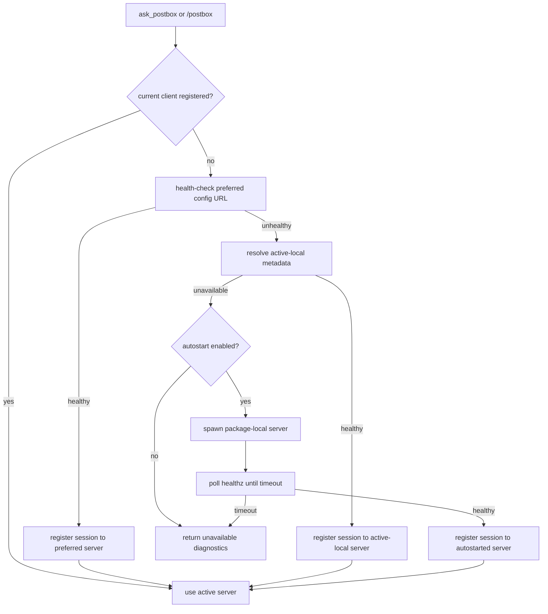

# feat: Publish combined Postbox package with autostart

## Overview

Publish Pi Postbox as a single user-facing npm package, `@wienerberliner/pi-postbox`, and make the Pi extension self-healing: when `ask_postbox` needs a server and the preferred/configured server is unreachable, the extension starts a package-local `pi-postbox-server` process and registers against it. Add operator/user status surfaces: `/postbox-status`, `/postbox`, and a read-only `postbox_status` tool.

---

## Problem Frame

Users should not need to think about whether the Postbox server is already running before Pi asks them for a remote decision. Pi package installation should install the extension and enough bundled server code for autostart, while shell CLI availability remains a separate npm global-install concern. The existing docs implied a bare `pi-postbox-server` command but Pi package installs do not add bins to the user's shell `PATH`.

---

## Requirements Trace

- R1. Publish one public npm package named `@wienerberliner/pi-postbox` that Pi can install as a package and npm can install globally for the CLI.
- R2. The package must expose the Pi extension through `pi` metadata and the shell CLI through `bin.pi-postbox-server`.
- R3. `ask_postbox` must recover from a missing/unreachable server by trying the preferred configured URL, active-local discovery, then package-local server autostart.
- R4. If a Pi Session registers with fallback local server, it must remain attached to that server until reload/restart rather than migrating mid-session.
- R5. Autostart must be opt-out with `PI_POSTBOX_AUTOSTART=off` and bounded by `PI_POSTBOX_AUTOSTART_TIMEOUT_MS` defaulting to 10 seconds.
- R6. `/postbox-status` and `postbox_status` must report connectivity, local URL, Tailnet URL when available, remote config export, open question count, autostart state, and diagnostics without exposing pending question content/history.
- R7. `/postbox` must be a user-only command that opens the active dashboard URL, autostarting if necessary, without optional arguments.
- R8. Documentation must clearly state the two install commands: `pi install npm:@wienerberliner/pi-postbox` for Pi resources/autostart and `npm install -g @wienerberliner/pi-postbox` for a shell `pi-postbox-server`.

---

## Scope Boundaries

- Do not create a systemd, launchd, or other operating-system service in this plan.
- Do not expose a tool that opens the browser; browser opening stays user-command-only.
- Do not show pending question prompts/options/answers in status output; only count open questions.
- Do not implement public Tailscale Funnel exposure.
- Do not migrate an active Pi Session from fallback local server back to a recovered preferred remote server mid-session.

### Deferred to Follow-Up Work

- Full package provenance/trusted-publishing workflow can be added after the package tarball shape is correct, unless the implementer chooses to include it in the packaging unit.
- Admin shutdown UX for autostarted servers is deferred; existing server shutdown/admin endpoints may remain as-is.

---

## Context & Research

### Relevant Code and Patterns

- `package.json` currently has root Pi metadata and workspace build scripts; it should become the public package surface or gain publish metadata for `@wienerberliner/pi-postbox`.
- `packages/extension/src/index.ts` registers `ask_postbox`, starts session registration, keeps module-level `client` and `currentRegistration`, and supervises active-local recovery.
- `packages/extension/src/activeLocalTargetResolver.ts` resolves configured URLs and active-local metadata. It currently treats explicit non-loopback configured URLs as selected without health verification, which conflicts with fallback-on-unreachable behavior.
- `packages/extension/src/commands/localFallback.ts` currently owns `/postbox-status` as pending-question fallback output. This command needs to be repurposed to operator status with open-question count only.
- `packages/server/src/cli.ts` already supports `serve`, `status`, `status --json`, active-local metadata publication, and Tailscale Serve status inspection.
- `packages/server/src/tailscaleServe.ts` and `packages/server/test/tailscaleServe.test.ts` provide the existing Tailnet URL/status behavior to reuse rather than duplicate ad hoc parsing.
- `packages/extension/test/extension.test.ts`, `packages/extension/test/activeLocalTargetResolver.test.ts`, `packages/extension/test/localFallback.test.ts`, and `packages/extension/test/askPostbox.test.ts` are the likely extension test homes.
- `packages/server/test/packageDocs.test.ts` locks package and docs expectations and should be updated for the new npm package identity and install docs.
- `scripts/smoke-postbox.mjs` verifies release behavior with built CLI assets and should keep proving the published/runtime path works.
- `docs/adr/0003-combined-npm-package-and-package-local-autostart.md` records the package/autostart decision.

### Institutional Learnings

- No `docs/solutions/` directory was present in this repository during planning.

### External References

- Pi package docs in the installed Pi documentation confirm that `pi install` loads package resources and that npm package discovery uses `keywords: ["pi-package"]`, but shell bins are an npm concern.

---

## Key Technical Decisions

- Single public package: Use `@wienerberliner/pi-postbox` as the user-facing package to avoid forcing users to understand protocol/server/extension split packages.
- Two install commands: Document Pi install for Pi resources and npm global install for shell bin because Pi install does not mutate shell `PATH`.
- Package-local autostart first: The extension should spawn the bundled server CLI with `node <package-root>/packages/server/dist/cli.js` when possible, falling back to `pi-postbox-server` on `PATH` only as a secondary path.
- Preferred server is not authoritative: Configured `PI_POSTBOX_URL` should be health-tested. If unreachable, local autostart is allowed.
- Status privacy boundary: Status reports counts and URLs only, not pending question content, options, history, or answers.
- Browser open is user-only: `/postbox` can spawn OS opener commands; no LLM tool may open the browser.

---

## Open Questions

### Resolved During Planning

- Should `/postbox-status` show pending questions? Resolution: no; show only open question count.
- Should autostart happen at Pi startup? Resolution: no; autostart on `ask_postbox` and `/postbox`, not read-only status.
- Should configured remote URL prevent local recovery? Resolution: no; it is preferred, then fallback local if unreachable.
- Should fallback sessions migrate back to remote? Resolution: no; stay attached until reload/restart.
- Should package autostart require global CLI install? Resolution: no; use bundled server first.

### Deferred to Implementation

- Exact helper/module names for status and autostart orchestration: defer to implementation while keeping behavior and test boundaries fixed.
- Exact OS opener fallback order for `/postbox`: use common platform conventions, but implementation can choose the smallest cross-platform helper that passes tests.

---

## High-Level Technical Design

> *This illustrates the intended approach and is directional guidance for review, not implementation specification. The implementing agent should treat it as context, not code to reproduce.*



---

## Implementation Units

- [ ] U1. **Publish package metadata and tarball shape**

**Goal:** Make the root package publishable as `@wienerberliner/pi-postbox` with Pi metadata, CLI bin, bundled runtime files, and gallery discovery metadata.

**Requirements:** R1, R2, R8

**Dependencies:** None

**Files:**
- Modify: `package.json`
- Modify: `package-lock.json`
- Modify: `packages/extension/package.json`
- Modify: `packages/server/package.json`
- Modify: `packages/protocol/package.json`
- Modify: `scripts/copy-web-to-server.mjs`
- Modify: `packages/server/test/packageDocs.test.ts`
- Test: `packages/server/test/packageDocs.test.ts`

**Approach:**
- Rename the root package to `@wienerberliner/pi-postbox`, remove or account for `private: true` for publishing, add `keywords` including `pi-package`, `publishConfig.access: public`, root `pi.extensions`, and root `bin.pi-postbox-server` pointing at the built server CLI.
- Preserve workspace development ergonomics, but ensure `npm pack --dry-run` includes every runtime file needed by Pi install and global CLI install.
- Decide during implementation whether internal workspace packages remain separately publishable or become private implementation details; the public install path should be the root combined package.
- Ensure internal runtime imports resolve in the packed tarball. Prefer bundled workspace package dependencies initially to minimize source refactors.

**Patterns to follow:**
- Existing package/docs assertions in `packages/server/test/packageDocs.test.ts`.
- Existing release smoke expectations in `scripts/smoke-postbox.mjs`.

**Test scenarios:**
- Happy path: root package metadata exposes `name: @wienerberliner/pi-postbox`, `keywords` includes `pi-package`, `pi.extensions` points at the extension, and `bin.pi-postbox-server` points at the built CLI.
- Integration: packed file list includes extension source, server dist, protocol dist, server public UI assets, README, and package metadata needed at runtime.
- Error path: package docs tests fail if docs still imply `pi install` alone makes a shell `pi-postbox-server` command available.

**Verification:**
- Package metadata tests pass and `npm pack --dry-run` output contains required runtime files without local caches, temp files, or secrets.

---

- [ ] U2. **Health-verified preferred server resolution**

**Goal:** Change configured non-loopback `PI_POSTBOX_URL` / config `serverUrl` from an unconditional selection into a preferred target that must be reachable before use.

**Requirements:** R3, R4

**Dependencies:** None

**Files:**
- Modify: `packages/extension/src/activeLocalTargetResolver.ts`
- Modify: `packages/extension/src/config.ts`
- Test: `packages/extension/test/activeLocalTargetResolver.test.ts`
- Test: `packages/extension/test/extension.test.ts`

**Approach:**
- Add health verification for explicit remote targets using `/healthz`, with bounded timeout behavior matching existing resolver conventions.
- Preserve source identity as `explicit-remote` when healthy, but return unavailable diagnostics when the preferred server cannot be reached.
- Ensure active-local fallback remains available after preferred server failure rather than being skipped.
- Preserve origin affinity once `registerResolvedTarget` creates a client; do not add live migration back to the preferred remote inside an active registration.

**Execution note:** Add resolver tests before changing resolver behavior because this changes an external configuration contract.

**Patterns to follow:**
- `verifyHealth` and diagnostic patterns in `packages/extension/src/activeLocalTargetResolver.ts`.
- Active-local health identity matching tests in `packages/extension/test/activeLocalTargetResolver.test.ts`.

**Test scenarios:**
- Happy path: healthy explicit remote URL is selected with `source: explicit-remote` and active-local polling disabled.
- Error path: unreachable explicit remote URL does not get selected and diagnostics include a remote health failure.
- Integration: when explicit remote is unreachable but fresh active-local metadata is healthy, active-local is selected.
- Edge case: loopback configured URL continues to follow configured-loopback/local recovery behavior.

**Verification:**
- Resolver behavior matches preferred-then-fallback semantics without broad discovery or port scanning.

---

- [ ] U3. **Package-local server autostart supervisor**

**Goal:** Add bounded autostart recovery that starts a reusable local server when `ask_postbox` or `/postbox` needs one and no preferred/active server is reachable.

**Requirements:** R3, R4, R5, R7

**Dependencies:** U1, U2

**Files:**
- Create: `packages/extension/src/autostart.ts`
- Modify: `packages/extension/src/index.ts`
- Modify: `packages/extension/src/client/PostboxClient.ts`
- Test: `packages/extension/test/autostart.test.ts`
- Test: `packages/extension/test/askPostbox.test.ts`
- Test: `packages/extension/test/extension.test.ts`

**Approach:**
- Add an extension-side recovery helper that can be called by `ask_postbox` and `/postbox` when no client/current registration exists.
- Autostart flow: retry preferred/active resolution, spawn bundled server CLI if still unavailable, poll health/active-local until healthy or timeout, then register the current Pi Session.
- Spawn the package-local CLI using Node and a path resolved relative to the installed package; fall back to `pi-postbox-server` on `PATH` with clear diagnostics if neither works.
- Use `PI_POSTBOX_AUTOSTART=off` to disable, and `PI_POSTBOX_AUTOSTART_TIMEOUT_MS` with default 10000ms for polling/spawn wait.
- Do not kill autostarted server on `session_shutdown`; it is intentionally reusable by other local Pi Sessions.
- Track whether this session initiated autostart for status reporting, without treating ownership as a reason to terminate the process.

**Technical design:** Directional helper shape:

```text
ensurePostboxAvailable(reason)
  if current client exists: return connected status
  resolve preferred/active targets
  if selected: register and return
  if reason permits mutation and autostart enabled: spawn + poll + register
  else return unavailable status
```

**Patterns to follow:**
- Existing no-client active-local supervisor in `packages/extension/src/index.ts`.
- Server active-local publication from `packages/server/src/cli.ts`.
- Fake long-running command approach in `packages/server/test/devLauncher.test.ts` for process-spawn tests.

**Test scenarios:**
- Happy path: `ask_postbox` with no reachable server spawns package-local CLI, waits for healthy metadata, registers, and sends the question.
- Happy path: when preferred server is healthy, autostart is not invoked.
- Error path: `PI_POSTBOX_AUTOSTART=off` prevents spawn and returns unavailable diagnostics.
- Error path: spawn unavailable or health timeout after 10s returns unavailable with install/run hint.
- Edge case: autostarted child is not stopped during session shutdown.
- Integration: two simulated sessions can reuse an already-published autostarted active-local server without spawning another process.

**Verification:**
- `ask_postbox` no longer fails simply because the server was initially down, and timeout/opt-out behavior is deterministic in tests.

---

- [ ] U4. **Status model, command, and read-only tool**

**Goal:** Replace pending-question `/postbox-status` behavior with privacy-preserving connectivity status, and expose equivalent structured data through `postbox_status`.

**Requirements:** R6

**Dependencies:** U2, U3

**Files:**
- Create: `packages/extension/src/status.ts`
- Modify: `packages/extension/src/index.ts`
- Modify: `packages/extension/src/commands/localFallback.ts`
- Modify: `packages/extension/src/client/PostboxClient.ts`
- Test: `packages/extension/test/localFallback.test.ts`
- Test: `packages/extension/test/extension.test.ts`
- Test: `packages/extension/test/askPostbox.test.ts`

**Approach:**
- Introduce a shared status snapshot builder used by both command and tool.
- Include connection state, active server URL, Tailnet URL when available, remote config export line, open question count, autostart enabled/started-by-this-session, and diagnostics.
- Do not include pending question prompt text, option labels/values, notes, history, or answers.
- Obtain Tailnet/status data by reusing server status JSON behavior where practical; avoid duplicating Tailscale parsing in the extension if a local server can answer or active-local metadata plus server CLI status is sufficient.
- Keep `/postbox-answer` and `/postbox-cancel` as local fallback commands if still needed, but remove pending-question details from `/postbox-status`.

**Patterns to follow:**
- Tool registration pattern in `packages/extension/src/index.ts` for `ask_postbox`.
- Server status JSON output shape in `packages/server/src/cli.ts` and `packages/server/test/cli.test.ts`.

**Test scenarios:**
- Happy path: `/postbox-status` notification includes connected state, local URL, Tailnet URL when available, export line, and open question count.
- Happy path: `postbox_status` returns structured JSON-equivalent details with the same fields.
- Privacy: status output with pending asks includes only count, not prompt/options/request content.
- Error path: disconnected status reports unavailable state and diagnostics without autostarting.
- Edge case: Tailnet unavailable still produces useful local URL and diagnostic output.

**Verification:**
- Status surfaces are read-only and safe for the LLM to call without exposing decision contents.

---

- [ ] U5. **User-only `/postbox` browser command**

**Goal:** Add `/postbox` as a user command that ensures a server is available, then opens the dashboard URL in the user's browser.

**Requirements:** R7

**Dependencies:** U3, U4

**Files:**
- Create: `packages/extension/src/commands/openPostbox.ts`
- Modify: `packages/extension/src/index.ts`
- Test: `packages/extension/test/openPostbox.test.ts`
- Test: `packages/extension/test/extension.test.ts`

**Approach:**
- Register `/postbox` as a command only; do not create an LLM tool for opening UI.
- If connected, open the active server URL. If disconnected, invoke the same mutating recovery/autostart path used by `ask_postbox`, then open the URL if ready within timeout.
- Use platform-appropriate openers with a manual URL fallback when no opener is available or command execution fails.
- Keep command surface minimal: no optional args in this plan.

**Patterns to follow:**
- Existing extension command registration style in `packages/extension/src/commands/localFallback.ts`.
- Node child-process mocking patterns in existing process-oriented tests.

**Test scenarios:**
- Happy path: connected `/postbox` invokes the OS opener with the active dashboard URL.
- Happy path: disconnected `/postbox` autostarts/re-registers, then opens the resulting URL.
- Error path: opener failure notifies the user with the URL to open manually.
- Error path: autostart timeout notifies the user with diagnostics and does not try to open an undefined URL.
- Privacy/control: no tool named `open_postbox` or equivalent is registered.

**Verification:**
- Users can open the dashboard without knowing whether the server was already running.

---

- [ ] U6. **Documentation, ADR alignment, and smoke coverage**

**Goal:** Update operator docs, README, ADR references, and smoke tests so the install/autostart/status story is accurate and durable.

**Requirements:** R1, R2, R5, R6, R7, R8

**Dependencies:** U1, U3, U4, U5

**Files:**
- Modify: `README.md`
- Modify: `docs/configuration.md`
- Modify: `docs/deployment.md`
- Modify: `docs/protocol.md`
- Modify: `docs/adr/0003-combined-npm-package-and-package-local-autostart.md`
- Modify: `scripts/smoke-postbox.mjs`
- Modify: `packages/server/test/packageDocs.test.ts`
- Test: `packages/server/test/packageDocs.test.ts`

**Approach:**
- Document the two install commands and why both exist.
- Document autostart behavior, opt-out, timeout, preferred server fallback semantics, and session stickiness.
- Document `/postbox-status`, `/postbox`, and `postbox_status` including the privacy boundary.
- Extend smoke/package docs checks to catch regressions in install guidance and published package shape.
- Keep Tailscale-only/no app-level-auth security warnings prominent because status now surfaces remote access URLs.

**Patterns to follow:**
- Existing docs assertions in `packages/server/test/packageDocs.test.ts`.
- Existing deployment/security sections in `README.md` and `docs/deployment.md`.

**Test scenarios:**
- Happy path: docs tests find `@wienerberliner/pi-postbox`, both install commands, autostart env vars, `/postbox`, `/postbox-status`, and `postbox_status`.
- Error path: docs tests reject wording that implies `pi install` alone exposes shell `pi-postbox-server` on `PATH`.
- Integration: smoke script still launches built server from release path and verifies health/UI/request flow with isolated config.

**Verification:**
- A new user can follow docs to install Pi resources, optionally install CLI, and understand when autostart happens.

---

## System-Wide Impact

- **Interaction graph:** `ask_postbox`, `/postbox`, `/postbox-status`, `postbox_status`, active-local resolver, server CLI status, Tailscale status, and package metadata now form one operator lifecycle.
- **Error propagation:** Resolver and autostart diagnostics must flow to tool results and user notifications without throwing during Pi startup.
- **State lifecycle risks:** Autostarted server may outlive the Pi Session; session registration must still shut down/cancel questions normally when Pi exits, while the server process remains reusable.
- **API surface parity:** CLI status, command status, and tool status should use compatible field names where practical.
- **Integration coverage:** Tests must cover recovery across extension/client/server boundaries, not only isolated parser helpers.
- **Unchanged invariants:** No broad local port scanning, no public Funnel automation, no app-level auth added, and Postbox Questions remain pinned to the server where they were created.

---

## Risks & Dependencies

| Risk | Mitigation |
|------|------------|
| Packed package misses runtime files | Add package docs/pack dry-run checks and keep smoke test using built release path. |
| Internal workspace imports fail after npm install | Bundle internal packages or refactor imports; verify with `npm pack --dry-run` and smoke from packed output if feasible. |
| Autostart spawns duplicate servers | Check preferred/active-local immediately before spawn and rely on canonical port/active-local publication; tests simulate reuse. |
| Autostart hides real remote outage | Surface diagnostics in status and tool result; configured remote remains preferred on reload/restart. |
| Status leaks decision contents | Centralize status snapshot and test that prompts/options/history are absent. |
| Browser open surprises users | Keep opening as `/postbox` user command only; no LLM tool can trigger it. |

---

## Documentation / Operational Notes

- Update docs to say `pi install npm:@wienerberliner/pi-postbox` installs Pi resources and bundled autostart server support.
- Update docs to say `npm install -g @wienerberliner/pi-postbox` is only needed for manual shell `pi-postbox-server` usage.
- Document `PI_POSTBOX_AUTOSTART=off` and `PI_POSTBOX_AUTOSTART_TIMEOUT_MS=10000`.
- Document that autostart is a reusable background process, not an OS service, and may remain running after Pi exits.
- Remind operators that Tailnet access remains unauthenticated at the app layer.

---

## Sources & References

- ADR: `docs/adr/0003-combined-npm-package-and-package-local-autostart.md`
- Glossary: `CONTEXT.md`
- Extension entrypoint: `packages/extension/src/index.ts`
- Active-local resolver: `packages/extension/src/activeLocalTargetResolver.ts`
- Existing commands: `packages/extension/src/commands/localFallback.ts`
- Server CLI/status: `packages/server/src/cli.ts`
- Package/docs tests: `packages/server/test/packageDocs.test.ts`
