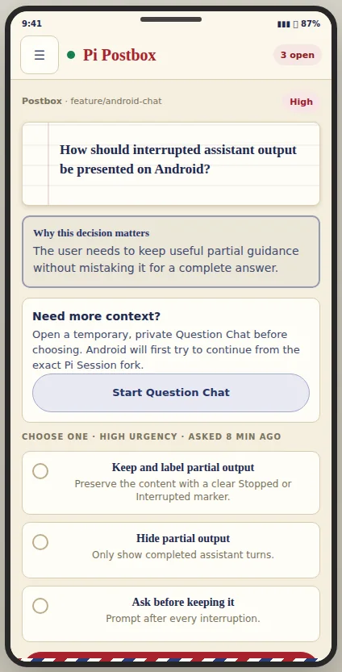
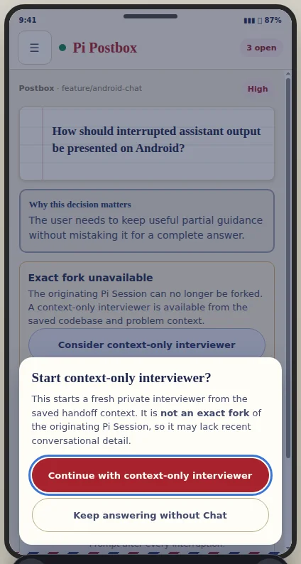
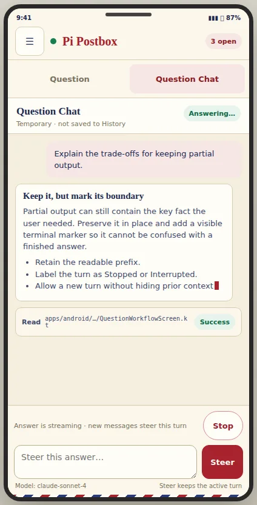
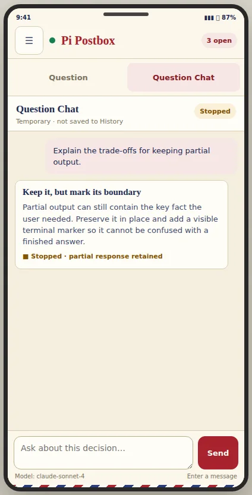
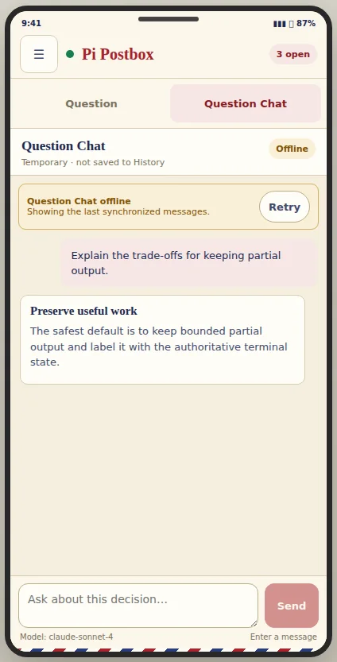
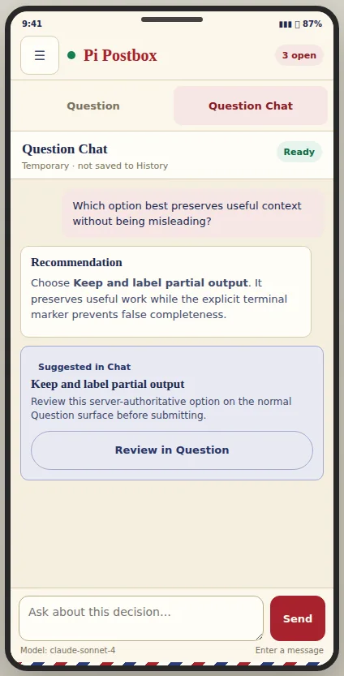
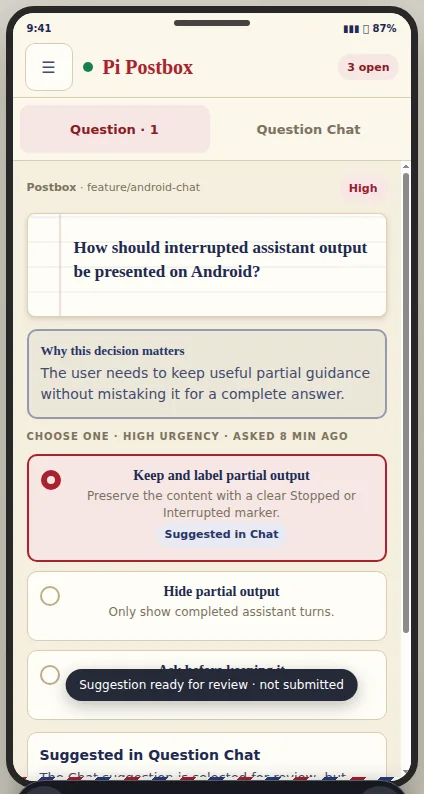
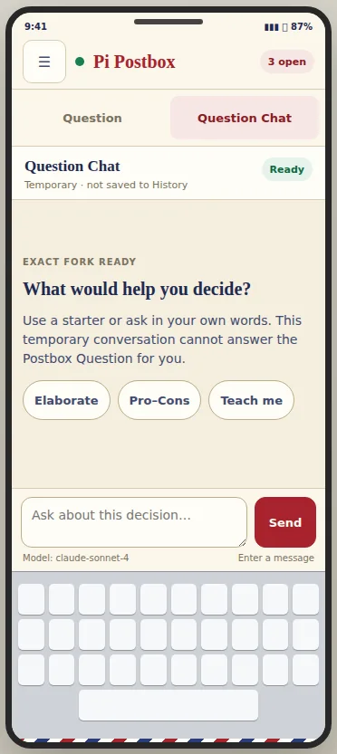

# Accepted native Android Question–Chat workspace

**Planning ticket:** [Prototype the native Question–Chat workspace](https://github.com/dasomji/pi-postbox/issues/61)

**Human decision:** **A — Workspace tabs**, accepted through Pi Postbox on 2026-07-29.

## Prototype question

Which native Compose information architecture keeps a pending Postbox Question and its temporary Question Chat clear through activation, fallback, streaming, recovery, and return-to-answer on a narrow Android screen?

A throwaway interactive browser prototype compared three structurally different mobile models:

1. **Workspace tabs:** the Postbox Question remains primary before activation; afterward, Question and Question Chat become peer tabs.
2. **Question Chat sheet:** Question Chat lives in a near-full-height modal sheet over the Postbox Question.
3. **Decision companion:** Question Chat becomes primary beneath a persistent compact decision rail, with the Postbox Question reopened in a review sheet.

The human selected **Workspace tabs**. It has the clearest native navigation and accessibility model, keeps the authoritative answer surface distinct from guidance, avoids modal-sheet/IME/nested-scroll complexity, and makes the return from a Chat-suggested option explicit.

## Accepted interaction model

### Before activation

- Show no workspace tabs. The existing Postbox Question remains the full primary surface.
- Place a secondary **Start Question Chat** action after the question context and before answer options. Its supporting copy says Question Chat is temporary and first attempts an exact fork.
- Starting Question Chat never changes or submits a draft answer.



### Exact-fork failure and context-only fallback

- Keep the user on the Postbox Question.
- Show the server-provided exact-fork failure as an inline warning with one **Consider context-only interviewer** action.
- That action opens a native confirmation surface with the full distinction: a context-only interviewer starts fresh from persisted handoff context and is not an exact fork of the originating Pi Session.
- Confirmation is explicit and cancellable. Cancel leaves the Question unchanged.
- After confirmation succeeds, reveal the tabs, select **Question Chat**, and keep a persistent degraded/context-only disclosure in that tab.
- If the server says context fallback is unavailable, show the reason and Retry/return path without offering confirmation.



### Activated workspace

- Add a two-item native tab row directly below the existing app bar: **Question** and **Question Chat**.
- Each tab owns one full-width, independently scrollable panel. Do not use a narrow split pane in this implementation slice.
- Preserve the Question draft selection and note while moving between tabs.
- Preserve Question Chat scroll/state through ordinary in-memory owner state; do not persist its transcript or draft.
- When Question Chat is selected, Android Back first returns to **Question**. Normal app navigation/back behavior resumes from the Question tab.
- Tab state is keyed with the current server and request ID and resets when either changes.

### Empty Question Chat

- Show a concise explanation that Question Chat can help understanding but cannot answer the Postbox Question.
- Present the three deterministic starters: **Elaborate**, **Pro–Cons**, and **Teach me**.
- Keep the freeform composer visible at the bottom.
- Label the exact-fork/context-only mode and model without making model metadata the primary hierarchy.

### Streaming, steer, tools, and Stop

- Stream assistant content into a message list above an anchored composer.
- During generation, keep the composer enabled and relabel its action **Steer**. Supporting text explains that a new message steers the active Question Chat turn.
- Put **Stop** beside the coarse active-turn status, not inside assistant prose.
- Show bounded tool activity as a separate collapsed row/card. It is not assistant Markdown and must not dominate the transcript.
- Announce only coarse state transitions such as Answering, Stopped, Interrupted, Offline, and Ready; the changing assistant body is not a live region.



### Stopped or interrupted output

- Retain the bounded readable assistant prefix.
- Mark the message itself **Stopped** or **Interrupted** and also expose the coarse workspace state.
- Keep the composer available for a later Question Chat turn when the authoritative state permits it.



### Offline and recovery

- Keep the last authoritative synchronized transcript visible.
- Show one inline **Question Chat offline** or resynchronizing banner with **Retry**.
- Disable composer, Steer, and Stop until the owner is synchronized and online.
- Do not describe in-memory content as “saved”; use “last synchronized messages.”



### Chat-suggested option return

- Render a server-authoritative proposal as a separate **Suggested in Chat** card with **Review in Question**.
- The action selects the **Question** tab and exposes/highlights the authoritative option there.
- It never submits automatically. Existing single/multi validation and the normal answer action remain authoritative.
- Announce that the suggestion is ready for review and not submitted.

| Suggested in Question Chat | Returned to authoritative Question |
|---|---|
|  |  |

## Narrow screens and IME

- Use the same tab information architecture at 360 dp and larger; do not introduce a second navigation model by width.
- Give the message list the remaining bounded height and keep the composer above system bars/IME using Compose insets.
- Focusing the composer must bring it into view without replacing tab selection or losing message scroll identity.
- Starters wrap rather than clip. Status/action rows may wrap at narrow widths.
- A visible IME must not cover Send/Steer/Stop or create two competing vertical scroll containers.



## Compose contract for later planning

The prototype settles information architecture, not production component code. The rendering/state tickets should preserve these seams:

```text
Question detail (pre-activation)
  -> exact activation attempt
  -> inline availability failure + explicit fallback confirmation
  -> activated Question | Question Chat tab workspace

Question Chat suggestion
  -> authoritative question/proposal update
  -> select Question tab
  -> highlight valid option
  -> ordinary answer submission only
```

Recommended native component shape:

- existing app bar and postal theme;
- Material 3 primary tab row with selected semantics;
- independently keyed `LazyColumn`/Question panel beneath it;
- anchored multiline composer with IME/navigation-bar insets;
- native confirmation dialog or modal bottom confirmation surface for context-only consent;
- Snackbar/status semantics for send-versus-steer acknowledgement and proposal return;
- minimum 48 dp actions and meaningful tab, state, Stop, Retry, and proposal labels.

The dedicated Question Chat owner selected by issues 59–60 remains responsible for server/request identity, lifecycle, bounded snapshots/events, safe Markdown documents, and strict in-memory privacy. Compose receives finite presentation state and emits user intents; it does not own transport or transcript persistence.

## Accessibility acceptance points

- Tabs expose selected state and distinct Question/Question Chat labels.
- Focus enters the confirmation surface and returns to its invoking action when cancelled.
- Switching tabs does not reset the Question draft or steal focus into progressively changing assistant text.
- Coarse status changes are announced once; streamed body replacements are not live-region announcements.
- Tool rows, safe links, Stop, Retry, starters, composer, and proposed-option return have explicit labels and native touch targets.
- The selected Chat-suggested option exposes both selected state and provenance without relying on color.

## Prototype disposition

The interactive three-variant implementation was intentionally throwaway and made no network requests or persistent writes. The selected behavior, rationale, and visual evidence are retained here; losing variant code should be removed rather than promoted to production.
